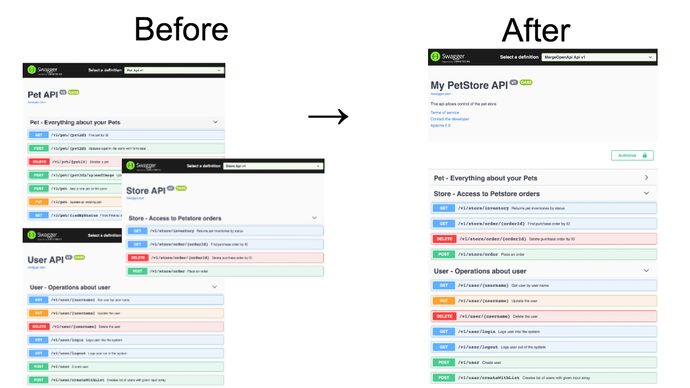

# MergeOpenApi

Code repository for the C# microservice application to merge OpenApi specifications in production.

The application consists of 4 seperate services that work together to allow you to merge OpenApi specifications on deployment. 

## Setup & Usage

The service is meant to be used with an API gateway To use this functionality you need to: 

1. [Deploy applications and create db](docs/1_deploy.md)
2. [Configure the system](docs/2_configure.md)
3. [Integrate into your deployment pipeline](docs/3_integrate.md)
4. Expose the UI service using an API Gateway or similar solution so that end users can see the resulting Merged OpenApi documentation
