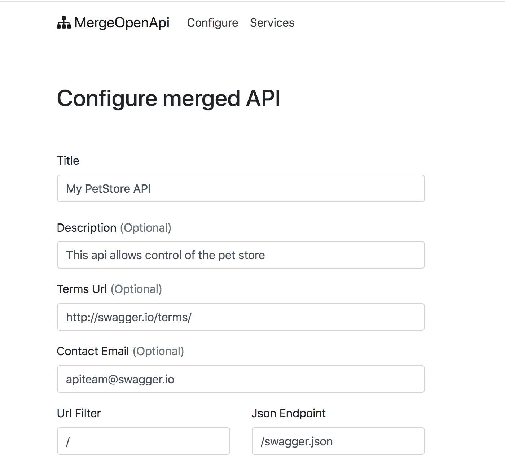
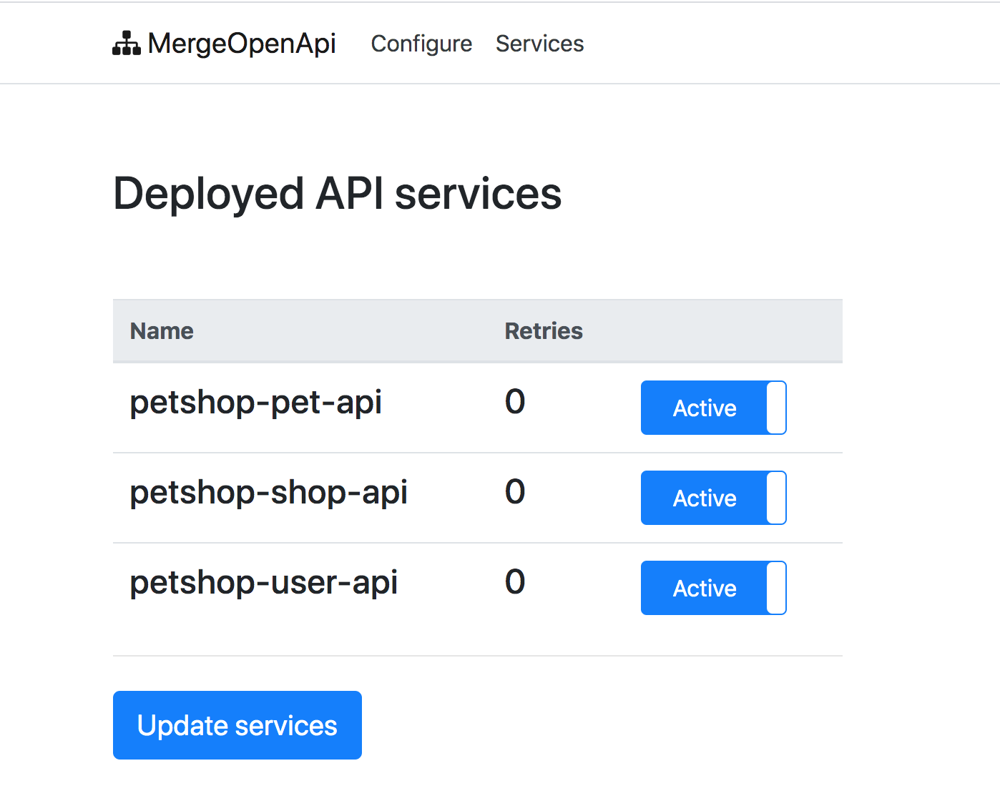

# Configuration
Before any API can be merged the application needs to be configured, this includes setting the title, description, terms, and contact of the resulting API.

If any optional field is not specified then the appropriate json is not generated, and it will not appear in the resulting API spec.

## Swagger endpoint & url filter
These 2 fields are important since they allow you to determine:
1. The endpoint where the swagger.json can be located on your microservices, this endpoint must be the same for all microservices or the application will fail to download the json.

2. A filter that decides which endpoints to include in the merged api (defaults to "/" meaning all endpoints), allowing you to exclude private endpoints. 

## Services
If you need to remove any microservice from the merged API the "Services" overview can be used to enable or disable any microservice API from inclusion. The overview also shows if the application is prevented from contacting any microservice API.

