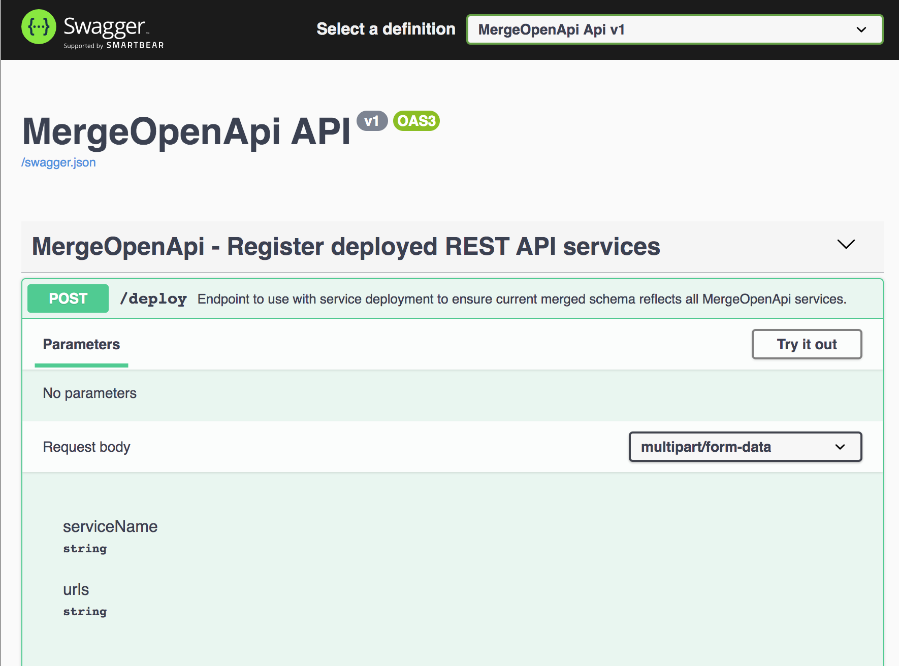

# Integration
In order for MergeOpenApi to know what API services to merge, the application needs to be told about them, this is done by invoking the deploy endpoint: 

The endpoint takes 2 parameters:
1. serviceName: Name of the deployed service to update, this has to be consistent accross deployments.
2. urls: Comma separated list of the deployed service urls that are reachable by the MergeOpenApi service.

Everytime the deploy endpoint is invoked it will trigger a merge operation.
